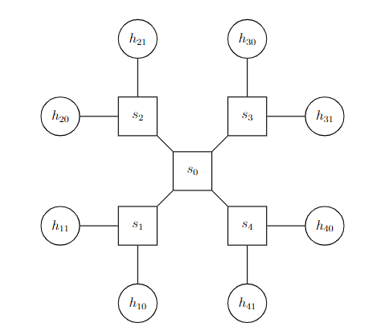

# ONOS-CPU Major-Project

## Introduction

This project is implementation of the following features:
- CPU utilization monitoring of the switches in the network
- Custom header appending to the packets with the CPU utilization information
- Make sure these custom headers are only added to the packets that are going out of the switch but not to the hosts
- Remove the custom headers from the packets that are going to the hosts

## Topology



## Getting Started

### Prerequisites
- Make sure to have docker installed on your machine. If not, you can install it from [here](https://docs.docker.com/get-docker/).
- Maven with JDK 11

### Installation
1. Clone the repository
```bash
$ git clone https://github.com/shank03/Major-Project.git -b onos-cpu onos-cpu
$ cd onos-cpu
```

2. Get docker images
```bash
$ make deps
```

3. Start the environment, and wait for this command to finish
```bash
$ make run
```

## Usage

Once the `make run` command has finished, you can access the ONOS GUI at [http://localhost:8181/onos/ui](http://localhost:8181/onos/ui) with the following credentials:
- Username: `onos`
- Password: `rocks`

> Note: If you ever want to get out of shell of any container, press `Ctrl+D`. Do not
> use `exit` command as it will stop the container.

Next, we enter into mininet container tests the implementation
```bash
$ make mn-cli
mininet> pingall    # all hosts should be able to ping each other
```

Next, on another terminal, we enter into ONOS container to check for the CPU utilization
```bash
$ make onos-cli     # with the same password as above mentioned
```
In case you get `error 255`, try pasting this snippet in your `~/.ssh/config` file:
```properties
Host *
  HostkeyAlgorithms +ssh-rsa,ssh-dss
  Port 8101
```
With this, you should get shell to ONOS like this:
```bash
onos@root >
```

Next, we check for the records, if any hosts has stored the CPU utilization information
```bash
# check for the records
# syntax: records <src-mac> <dst-mac (optional)> <provider (optional)>
# info: provider is the switch where the onos received records from

onos@root > records 00:00:00:00:01:00/None 00:00:00:00:05:00/None

# Output should be empty as we haven't enable recording yet.
```
You can also press `TAB` to auto-complete the command.

Since, the records are empty, we enable the recording in ONOS cli using the following command:
```bash
# syntax: start-rec <src-mac> <dst-mac>
onos@root > start-rec 00:00:00:00:01:00/None 00:00:00:00:05:00/None
# Output: Started recording CPU for 00:00:00:00:01:00/None - 00:00:00:00:05:00/None
```

Next, in the mininet cli, we make 3 pings from `h10` to `h30` using the following command:
```bash
mininet> h10 ping -c3 h30
```
Output:
```
PING 192.168.1.6 (192.168.1.6) 56(84) bytes of data.
64 bytes from 192.168.1.6: icmp_seq=1 ttl=64 time=13.9 ms
64 bytes from 192.168.1.6: icmp_seq=2 ttl=64 time=16.5 ms
64 bytes from 192.168.1.6: icmp_seq=3 ttl=64 time=7.70 ms

--- 192.168.1.6 ping statistics ---
3 packets transmitted, 3 received, 0% packet loss, time 2003ms
rtt min/avg/max/mdev = 7.704/12.729/16.536/3.707 ms
```

Next, we check for the records again in the ONOS cli:
```bash
onos@root > records 00:00:00:00:01:00/None 00:00:00:00:05:00/None
```
Output:
```
DPID: 33:00:00:00:00:00; CPU: 13; Timestamp: 633591590
DPID: AA:00:00:00:00:00; CPU: 13; Timestamp: 633736386
DPID: 11:00:00:00:00:00; CPU: 6; Timestamp: 633705254
DPID: 33:00:00:00:00:00; CPU: 7; Timestamp: 634592480
DPID: AA:00:00:00:00:00; CPU: 7; Timestamp: 634737352
DPID: 11:00:00:00:00:00; CPU: 13; Timestamp: 634707062
DPID: 33:00:00:00:00:00; CPU: 6; Timestamp: 635591240
DPID: AA:00:00:00:00:00; CPU: 13; Timestamp: 635737993
DPID: 11:00:00:00:00:00; CPU: 7; Timestamp: 635708149
-------------------
```

Next, we stop the recording in the ONOS cli using the following command:
```bash
# syntax: stop-rec <src-mac> <dst-mac>
onos@root > stop-rec 00:00:00:00:01:00/None 00:00:00:00:05:00/None
# Output: Stopped recording CPU for 00:00:00:00:01:00/None - 00:00:00:00:05:00/None
```

You can stop the whole environment using the following command:
```bash
$ make stop
```

## Conclusion

Hosts can trasmit packets to each other without breaking protocol with the hidden abstraction of tracking CPU utilization of the switches in the network and sharing 
metric information to the ONOS controller.
