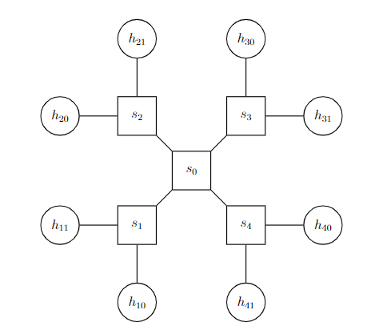

# SDN - BMv2 - P4 CPU utilization

## Introduction

This document describes the steps to monitor the CPU utilization of a P4 switch.

Reference: [P4lang tutorial](https://github.com/p4lang/tutorials)

## Prerequisites

- VM from [P4lang tutorial](https://github.com/p4lang/tutorials)

## Topology



Switches: 5
- s0 - AA:00:00:00:00:00
- s1 - 11:00:00:00:00:00
- s2 - 22:00:00:00:00:00
- s3 - 33:00:00:00:00:00
- s4 - 44:00:00:00:00:00

Hosts: 8
- h10 - 00:00:00:00:00:01 - 192.168.1.2/24
- h11 - 00:00:00:00:00:02 - 192.168.1.3/24
- h20 - 00:00:00:00:00:03 - 192.168.1.4/24
- h21 - 00:00:00:00:00:04 - 192.168.1.5/24
- h30 - 00:00:00:00:00:05 - 192.168.1.6/24
- h31 - 00:00:00:00:00:06 - 192.168.1.7/24
- h40 - 00:00:00:00:00:07 - 192.168.1.8/24
- h41 - 00:00:00:00:00:08 - 192.168.1.9/24

## Setup the environment

- Setup VM from [P4lang tutorial](https://github.com/p4lang/tutorials) and boot it.

- Clone the repository
    ```bash
    git clone https://github.com/shank03/Major-Project.git
    cd Major-Project/p4-cpu
    ```

## Run the code

- Run the container and wait for it to finish
    ```bash
    sudo make run
    ```
- Verify topology
    ```bash
    mininet> pingall # should ping all hosts
    ```
- Enter into hosts, here we will enter `h10` and `h30` for demonstration
    ```bash
    mininet> xterm h10 h30
    ```
- In `h10` terminal, run the following command
    ```bash
    python records/send.py h10-eth0 00:00:00:00:05:00
    ```
- In `h30` terminal, run the following command
    ```bash
    python records/receive.py h30-eth0
    ```
    You should be able to see the packets received in `h30` terminal.
- Now open mininet cli in another terminal and run the following command
    ```bash
    mininet> iperf <s> <d>
    ```
    changing `<s>` and `<d>` should reflect the CPU utilization metrics in `h30` terminal.


## Results

All the headers information from packets received by `h30` are stored in `records/cpu.csv`.
In order to generate graph for visualization, there are 2 ways:
- Exit the mininet, and upon exit the graph image will be automatically created at `records/cpu.png`

OR
- Stop the receive script and run the following command outside of host:
    ```bash
    sudo python3 records/graph.py
    ```
